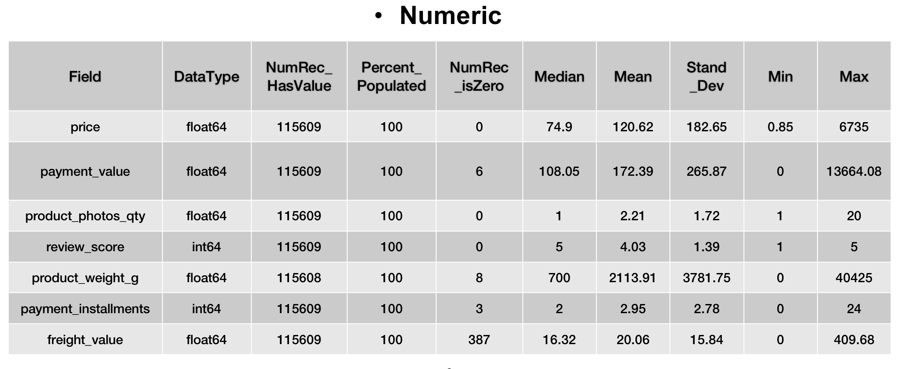
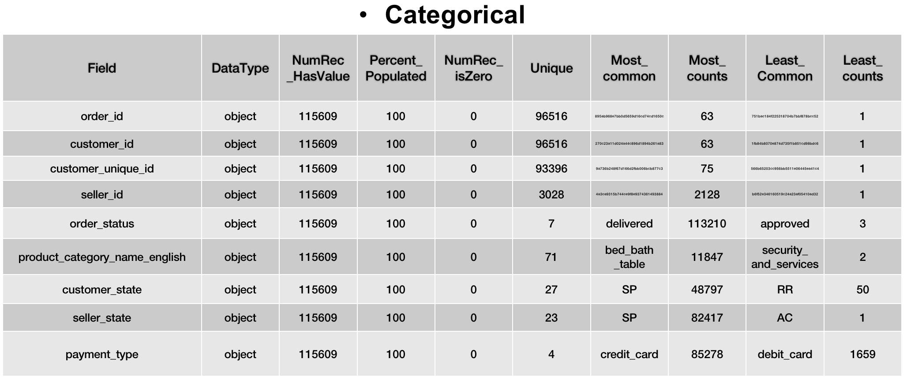
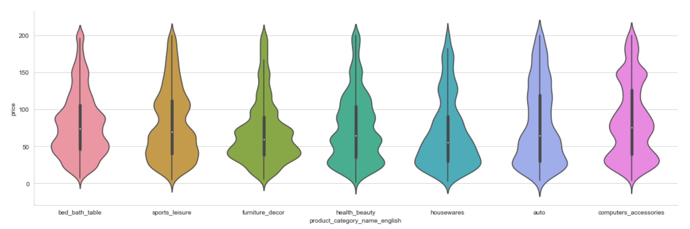

## Brazil-E-commerce-Customer-RMF-Analysis
An exercise: analyzing customer RMF to optimize targetted business stratgegy.

### Data Quality Report
   #### Data High-Level Description:
    This is a Brazilian ecommerce public dataset of orders made at Olist Store, 
    consisted of 8 Entity Relashionship Diagrams(ERD). 
    The dataset has information of 100k orders from 2016 to 2018 made at multiple marketplaces in Brazil. 
    Its features allows viewing an order from multiple dimensions: from order status, price, 
    payment and freight performance to customer location, product attributes and finally reviews written by customers.
    
    https://www.kaggle.com/datasets/olistbr/brazilian-ecommerce
    Some dataset exceeds GitHub's 25MB limit, can not be uploaded. They're also available in the above link. 
    
   #### Summary Information for All Fields:
    Through merging the 8 ERD, data cleaning, attribute selection, we come to the numeric and categorical frames:
    

   #### Fields Short Descriptions:
    Investigated some interesting attributes distribution
 

    
### Customer RMF
    I was curious about the consumer pattern and customer lifetime value, 
    hence the recency, frequency, monetary analysis.
    Comparing each customer unique ID's latest purchase timestamp 
    with the latest purchase timestamp across all database. Recency result is distant.
    

    
    Monery histogram corroborates the Price per Transaction

    Due to frequency histogram is disproportionately concentrated on "1 time" column, I added log to the y scale, showing as 

    Scored the customers based on 3 criterion on a 1 to 5 scale, every customer is assigned a 3 digit score. 
    Assorted the customers based on the scores into 10 segmentations:

### Correlation
    I was trying to explore the factors that affect the customer satisfaction, 
    however based on this dataset there is no significant correlation with any known factors. 
    Attached is the box plot between price distribution in each review score. 
    

    
    After multiple sets of comparison between review score and other variants, 
    I generated a correlation coefficient heatmap for all numeric variants:

    
    Also attempted to investigate if this E-commerce company has other "competitiveness", 
    no significant findings. Attached is the delivery time distribution chart based on date-time variance "processing".

    
    Some interesting results when I analyzed customers order place timestamp
    Purchase time distribution

    
    Other noteworthy analysis results are also included in the code. 
    Final image here is the business growing trend, intriguingly the sales peaked in November 2017, 
    more discussion in the code for your information.

